# Uyku — Sleep & Recovery Tracker

Uyku süreni, tahmini uyku evrelerini ve kaliteni gösteren sakin, sıcak ve reklamsız bir uyku takipçisi. Flutter ile yazıldı, arayüz tamamen **Türkçe**dir. Veriler yalnızca cihazda tutulur.

<p align="center">
  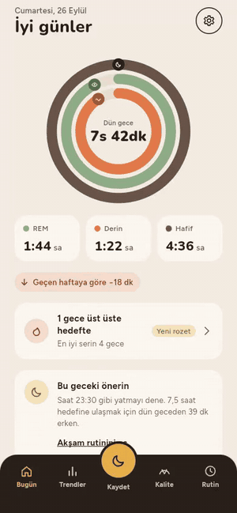
</p>

<p align="center">
  <a href="docs/media/demo.mp4"><b>Videoyu MP4 olarak izle</b></a>
</p>

<p align="center">
  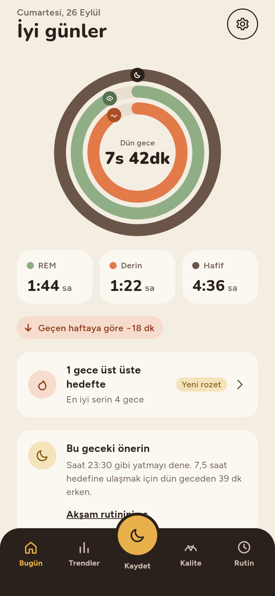
  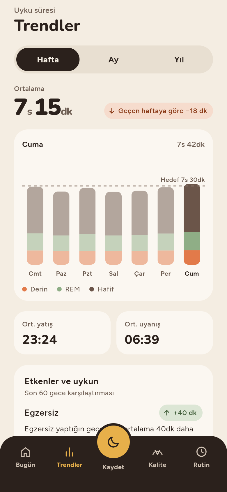
  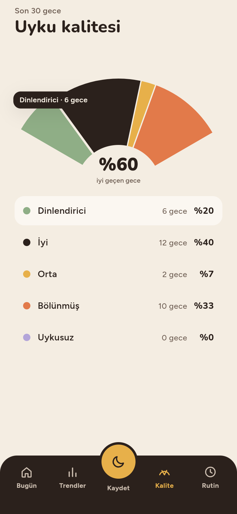
  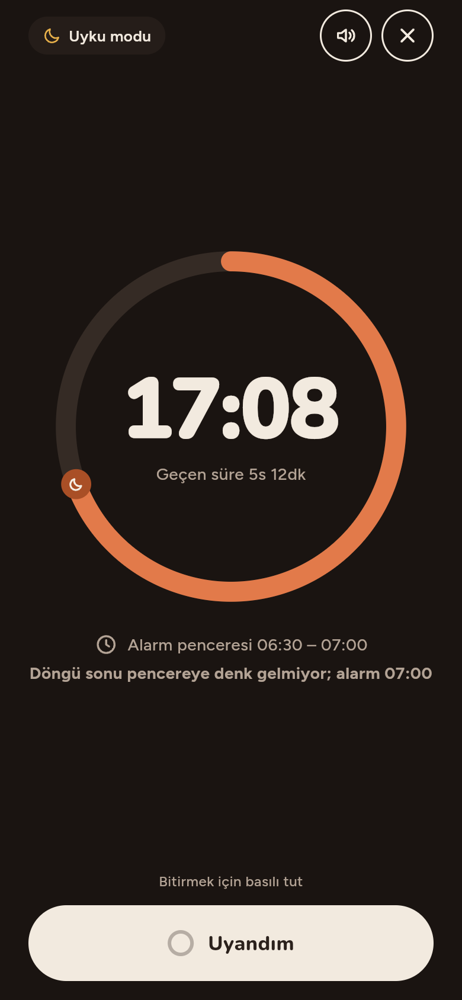
</p>

> Görsel ve video, uygulamanın web derlemesinden 390×844 pt çerçevede çekildi. Ekranlardaki kayıtlar yalnızca bu görseller için yüklenmiş **örnek verilerdir**.

---

## İçindekiler

- [Öne çıkanlar](#öne-çıkanlar)
- [Ekranlar](#ekranlar)
- [Açık ve koyu tema](#açık-ve-koyu-tema)
- [Özellikler ayrıntılı](#özellikler-ayrıntılı)
- [Teknolojiler](#teknolojiler)
- [Mimari](#mimari)
- [Tasarım sistemi](#tasarım-sistemi)
- [Erişilebilirlik](#erişilebilirlik)
- [Kurulum ve çalıştırma](#kurulum-ve-çalıştırma)
- [Doğrulama](#doğrulama)
- [Proje kuralları](#proje-kuralları)

---

## Öne çıkanlar

- **Günlük özet**: toplam uyku, REM ve derin uyku üç iç içe animasyonlu halkada. Hedefe göre dolar ve geçen haftayla karşılaştırılır.
- **Hızlı kayıt**: yatış ve uyanış saati, uyanma hissi, uykuyu etkileyen etkenler ve rüya günlüğü tek ekranda.
- **Trendler**: hafta, ay ve yıl görünümünde yığılı evre grafiği, hedef çizgisi, ortalama yatış ve uyanış saati.
- **Uyku kalitesi**: son 30 gecenin beş gruba dağılımı, dokunulabilir yelpaze grafikte.
- **Uyku modu**: gece boyunca açık kalan koyu ekran, tahmini akıllı alarm penceresi ve basılı tutarak onaylanan "Uyandım".
- **Akşam rutini**: hatırlatıcı, işaretlenebilir adımlar, uyku sesleri ve 4-7-8 nefes egzersizi.
- **Motivasyon**: seriler, 11 rozet ve haftalık rapor.
- **Gizlilik**: hesap, sunucu ve analitik yok. Her şey cihazdaki `shared_preferences` içinde JSON olarak saklanır.

## Ekranlar

### Ana sekmeler

Alt paneldeki beş sekme `StatefulShellRoute` ile durumunu korur. Ortadaki bal rengi buton Kaydet ekranını açar.

| Bugün | Trendler | Kaydet | Kalite | Rutin |
|:---:|:---:|:---:|:---:|:---:|
|  |  | 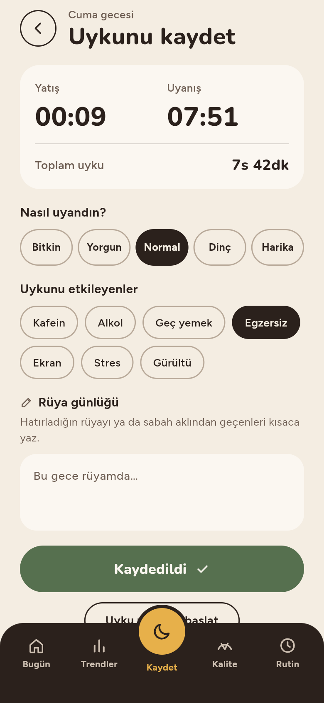 |  | 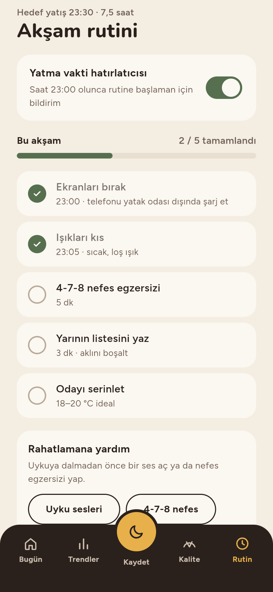 |
| Halka grafiği, evre kutuları, seri kartı, gece önerisi | Evre grafiği, ortalamalar, etken analizi | Saatler, his, etkenler, rüya notu | 30 gecelik yelpaze ve gruplar | Hatırlatıcı, ilerleme, adımlar |

### Tam ekran sayfalar

| Uyku modu | Ayarlar | Hedefler | Haftalık rapor |
|:---:|:---:|:---:|:---:|
|  | 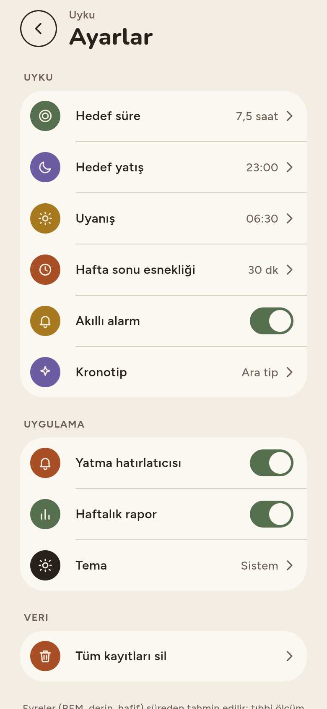 | 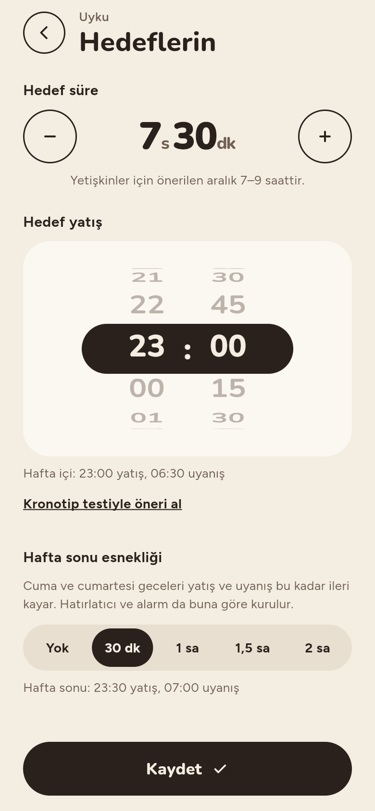 | 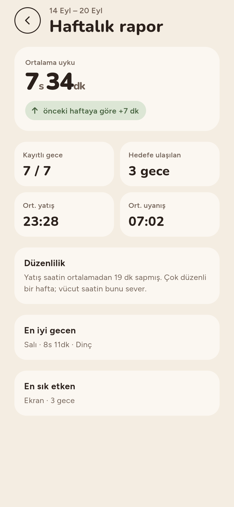 |

| Rozetler | Uyku sesleri | 4-7-8 nefes | Kronotip testi | Kurulum |
|:---:|:---:|:---:|:---:|:---:|
| 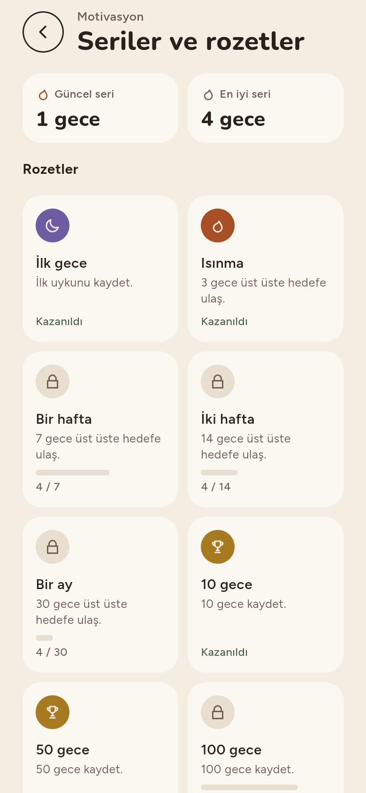 | 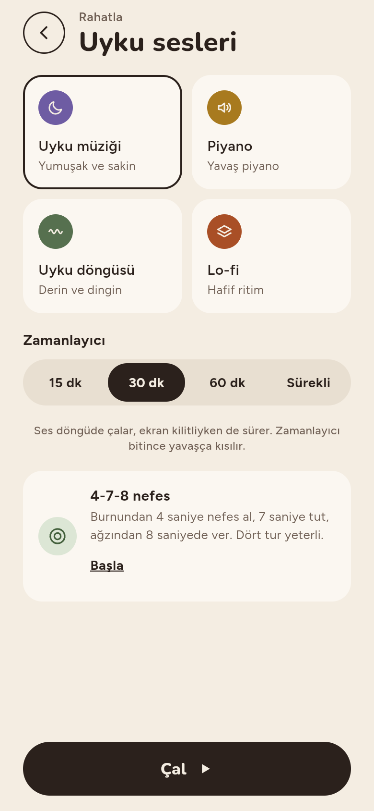 | 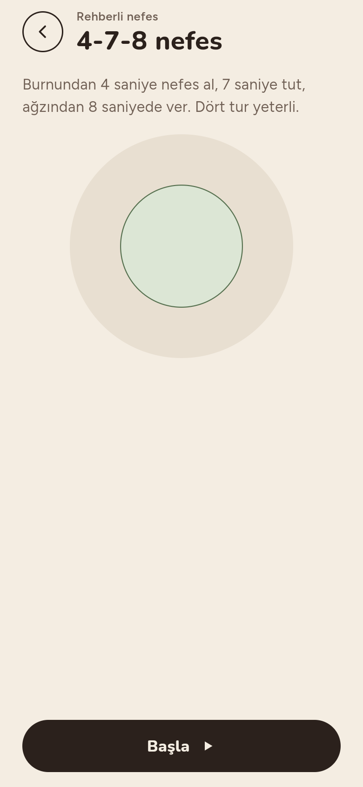 | 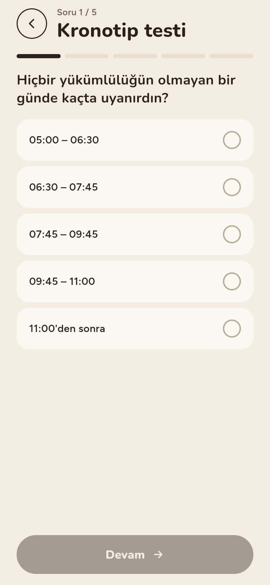 | 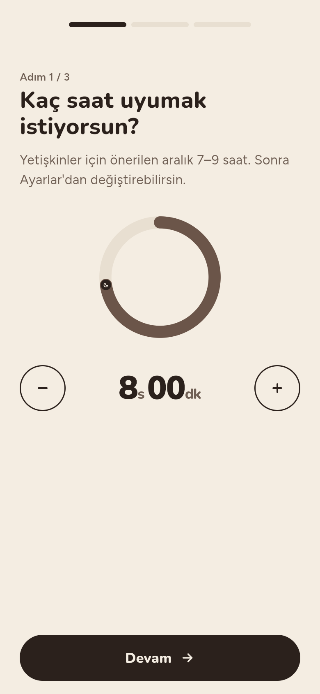 |

## Açık ve koyu tema

Tema sistem ayarını izler veya Ayarlar'dan elle seçilir. Koyu tema saf siyah yerine koyu espresso tonlarını kullanır. Uyku modu her zaman koyudur.

| Bugün | Trendler | Kalite | Kaydet | Rutin |
|:---:|:---:|:---:|:---:|:---:|
| 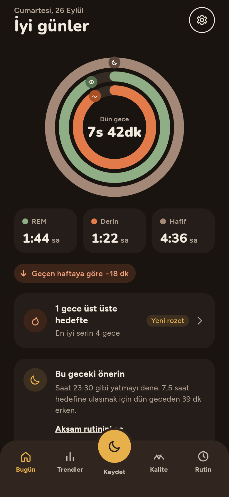 | 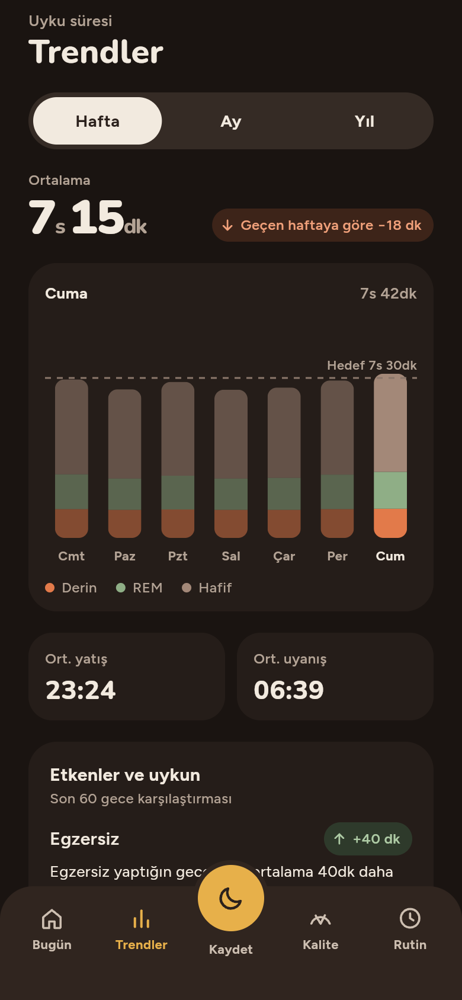 | 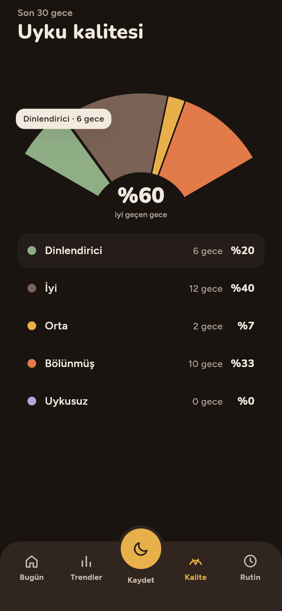 | 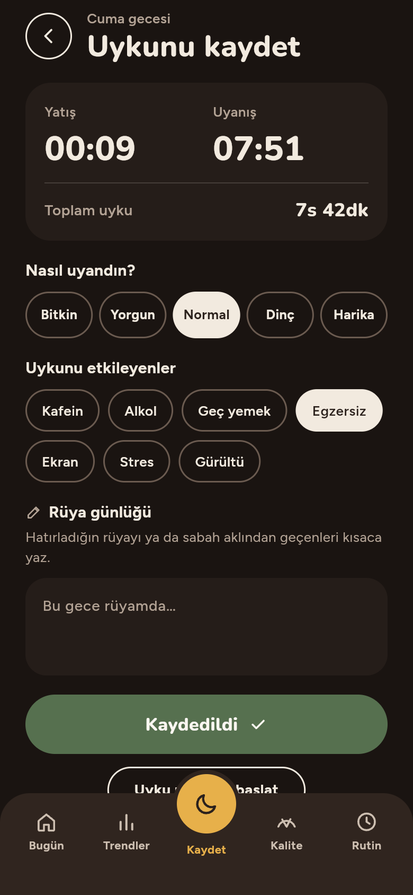 | 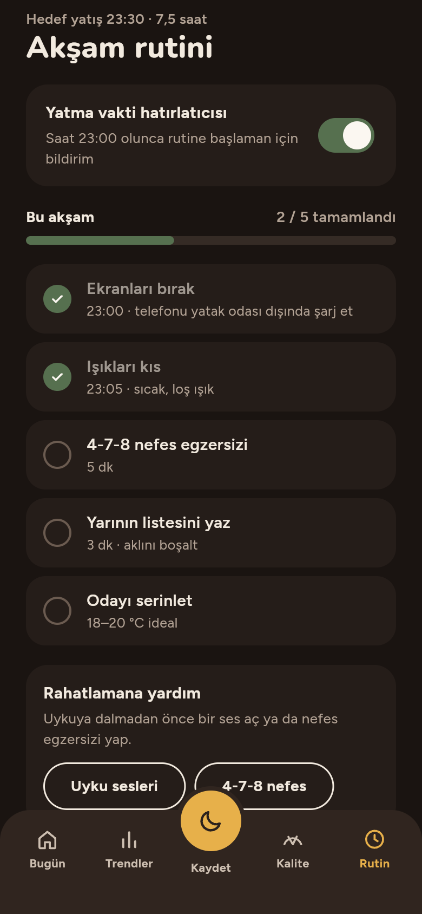 |

## Özellikler ayrıntılı

### Bugün (`/`)
- Tarih ve günün saatine göre selam. Sağ üstteki buton Ayarlar'ı açar.
- 240 pt `SleepRingChart`: dış halka toplam uyku / hedef, orta halka REM, iç halka derin uyku. Halkalar 120 ms arayla 900 ms'de dolar; uçlarında ikonlu rozetler vardır.
- REM, Derin ve Hafif için `StageMetricTile` kutuları ve geçen haftaya göre fark (`DeltaBadge`).
- Seri kartı (yeni kazanılan rozet işaretlenir), gecenin hedefine göre öneri ve "Akşam rutinini aç" bağlantısı. Pazar günleri haftalık rapor kartı da çıkar.
- Boş, yükleniyor ve hata durumları ayrı ekranlarla tasarlandı.

### Kaydet (`/log`)
- Yatış ve uyanış saati ±5 dk adımlarla değişir. Toplam süre anında hesaplanır.
- "Nasıl uyandın?" için 5 seçenek: Bitkin, Yorgun, Normal, Dinç, Harika.
- 7 etken: Kafein, Alkol, Geç yemek, Egzersiz, Ekran, Stres, Gürültü.
- **Rüya günlüğü**: en çok 1000 karakterlik serbest not, kayıtla birlikte saklanır.
- Her geceye tek kayıt düşer. Kayıt kimliği gecenin tarihidir (`2026-09-24`), aynı geceyi yeniden kaydetmek üzerine yazar. Kaydedince buton adaçayı yeşiliyle "Kaydedildi" olur.

### Trendler (`/trends`)
- Hafta / Ay / Yıl `SegmentedPill`. Çubuklar aralık değişince 380 ms'de akarak yeniden biçimlenir.
- `fl_chart` ile yığılı evre grafiği (Derin / REM / Hafif), kesikli hedef çizgisi ve seçili çubuğun ayrıntısı.
- Ortalama süre, önceki döneme göre fark, ortalama yatış ve uyanış saati.
- **Etken analizi**: son 60 gecede her etken için etkenli ve etkensiz gecelerin ortalama süresi ve iyi gece oranı karşılaştırılır. İki tarafta da en az 3 gece gerekir. Kartta "neden-sonuç değildir" notu yer alır.

### Uyku kalitesi (`/quality`)
- Son 30 gece beş gruba ayrılır: Dinlendirici, İyi, Orta, Bölünmüş, Uykusuz.
- Puan 0–100 arasıdır: süre / hedef oranı (60) + uyanma hissi (40) − olumsuz etkenler. Egzersiz küçük bir artı puan verir. 5 saatin altı "Uykusuz", bitkin uyanılan ya da alkol veya gürültü bulunan geceler "Bölünmüş" sayılır.
- `SleepQualityFanChart`: 120° yelpaze. Dokunulan dilim 8 px dışa kayar ve ipucu gösterir. Hit test açı ve yarıçapla yapılır.

### Akşam rutini (`/routine`)
- Yatma vakti hatırlatıcısı (yatıştan 30 dk önce yerel bildirim).
- İlerleme çubuğu ve 5 işaretlenebilir adım. Adımlar akşama göre saklanır, son 60 akşam tutulur.
- "Rahatlamana yardım" kartından Uyku sesleri ve 4-7-8 nefes açılır.

### Uyku modu (`/track`)
- 300 pt ember halka içinde büyük saat ve geçen süre. Uyku modu açıkken uygulama her açılışta bu ekrana yönlenir.
- **Akıllı alarm (tahmini)**: hafif uykuyu ölçmez. 15 dk dalma süresi ve 90 dk'lık döngüler varsayılarak alarm, uyanış − 30 dk ile uyanış arasındaki penceredeki son döngü sonuna kurulur. Pencereye döngü sonu denk gelmezse pencere sonuna kurulur.
- "Uyandım" butonu 1,2 sn basılı tutulunca onaylanır. Ekran okuyucular için ayrı bir onay eylemi vardır. Bitince "Günaydın" özeti gösterilir.

### Diğer özellikler
| Özellik | Rota | Ayrıntı |
|---|---|---|
| Kurulum | `/onboarding` | 3 adım: hedef süre (5–11 sa, 15 dk adım), `CupertinoPicker` tabanlı yatış seçici ve alarm penceresi, sağlık ve bildirim izinleri. |
| Hedefler | `/goals` | Hedef süre, hedef yatış, hafta sonu esnekliği (0 / 30 / 60 / 90 / 120 dk; cuma ve cumartesi geceleri kayar). |
| Kronotip testi | `/chronotype` | Kısaltılmış Horne–Östberg anketinden 5 soru. Sabahçı, ara tip veya akşamcı sonucu ve 15 dk'ya yuvarlanmış önerilen yatış saati. |
| Haftalık rapor | `/report` | Pazar akşamından cumartesiye 7 gece: ortalama, önceki haftayla fark, hedefe ulaşılan geceler, düzenlilik (yatış sapması), en iyi gece ve en sık etken. Pazar 09:00 bildirimi, dokununca rapor açılır. |
| Seriler ve rozetler | `/badges` | Hedefe ulaşılan ardışık geceler ve 11 rozet. Rozetler kayıtlardan hesaplanır, cihazda yalnızca "görüldü" listesi tutulur. |
| Uyku sesleri | `/sounds` | Uyku müziği, Piyano, Uyku döngüsü, Lo-fi. Döngüde çalar. 15 / 30 / 60 dk veya sürekli zamanlayıcı, sonunda 8 sn'de kısılarak durur. iOS'ta arka planda çalar. |
| 4-7-8 nefes | `/breathe` | 4 sn al, 7 sn tut, 8 sn ver; 4 tur. Bitince rutindeki nefes adımı işaretlenir. Hareket azaltma açıksa daire büyümez. |
| Bileşen galerisi | `/debug/gallery` | Yalnızca debug derlemesinde. Halka, kontrol, fan, renk ve ölçü sekmeleri. |

> **Evreler tahminidir.** Uygulama evreleri ölçmez; `StageEstimator` süreden 90 dakikalık döngü modeliyle deterministik olarak tahmin eder (derin uyku ilk döngülerde, REM son döngülerde ağır basar). Arayüz bunu açıkça belirtir; tıbbi ölçüm değildir.

## Teknolojiler

| Alan | Kullanılan | Neden |
|---|---|---|
| Framework | **Flutter** (Dart 3, SDK `^3.9.2`), Material 3 | Tek kod tabanıyla iOS, Android ve web. Material varsayılanları (ripple, elevation, varsayılan AppBar) tema ile kapatıldı. |
| State | **flutter_riverpod** 3 | Provider'lar elle tanımlanır (`Provider`, `NotifierProvider`, `FutureProvider`). Ekran durumları `.autoDispose`. |
| Routing | **go_router** 17 | `StatefulShellRoute.indexedStack` ile 5 sekme; kurulum ve uyku modu için yönlendirme kuralları. |
| Grafik | **fl_chart** + özel `CustomPainter` | Trend çubukları `fl_chart` ile; halka ve yelpaze grafikleri sıfırdan `CustomPainter` ile çizildi. |
| Depolama | **shared_preferences** | Kayıtlar, ayarlar ve rutin JSON olarak cihazda. |
| Bildirim | **flutter_local_notifications**, **timezone**, **flutter_timezone** | Gece başına haftalık yatma hatırlatıcısı ve haftalık rapor. Bildirim payload'ı ilgili rotayı açar. |
| Ses | **just_audio**, **audio_session** | Döngüde çalan uyku sesleri, zamanlayıcı ve yumuşak kısma. iOS'ta `UIBackgroundModes: audio`. |
| Yerelleştirme | **flutter_localizations**, **intl** | TR locale; `NumberFormat` ile `8,25 sa`, `7s 42dk`, `HH:mm`. Metinler `AppStrings` sınıfında. |
| Font | **Nunito** + **Figtree** (`assets/fonts/`) | Çevrimdışı çalışsın diye uygulamaya gömülü; `google_fonts` kullanılmaz. |
| Lint | **very_good_analysis** | Katı lint kuralları; `flutter analyze` 0 uyarı. |
| Sağlık (planlı) | `health` | HealthKit ve Health Connect, mevcut `SleepRepository` arayüzüyle eklenecek. |

**Kod üretimi yok:** `build_runner`, `freezed`, `json_serializable`, `riverpod_generator` ve `gen-l10n` kullanılmaz. Modellerin `copyWith`, `==`, `toJson` / `fromJson` metotları elle yazılır; `flutter run` öncesi ek adım gerekmez.

## Mimari

Feature-first klasör yapısı. Her özellik `domain` / `data` / `presentation` katmanlarına ayrılır.

```
lib/
  main.dart                  # Giriş: SharedPreferences, bildirim servisi, ProviderScope, UykuApp
  core/
    theme/                   # Renk, tipografi, boşluk, radius, gölge, hareket tokenları + ThemeData
    widgets/                 # SleepRingChart, SleepQualityFanChart, AppNavPanel, PrimaryPillButton…
    router/                  # go_router tanımı ve sayfa geçişleri
    providers/               # sharedPreferences, clock, notificationService
    notifications/           # NotificationService (yerel bildirimler; web'de no-op)
    strings/                 # AppStrings: kullanıcıya görünen tüm metinler
    utils/                   # Süre, saat ve ondalık biçimleyiciler
  features/
    sleep_summary/           # Bugün ekranı ve uygulama kabuğu
    sleep_log/               # SleepEntry, SleepRepository, Kaydet ekranı, kalite sınıflandırıcı
    trends/  sleep_quality/  insights/  weekly_report/  streaks/
    track_sleep/             # Uyku modu, akıllı alarm planı
    routine/  sounds/  chronotype/  onboarding/  settings/
  debug/                     # Bileşen galerisi
```

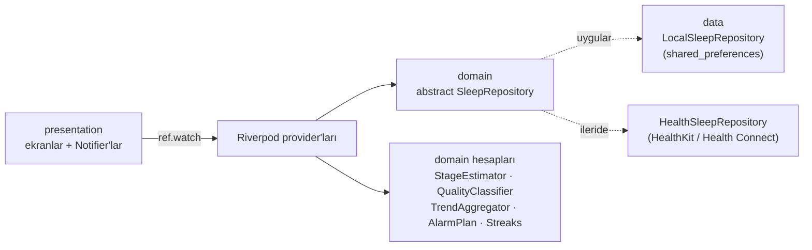

- **domain**: değişmez modeller, saf hesaplama sınıfları ve `abstract interface class` repository'ler.
- **data**: `shared_preferences` üstünde yerel uygulamalar. Sağlık entegrasyonu aynı arayüzle eklenip provider override ile değiştirilecek.
- **presentation**: ekranlar, ekrana özel widget'lar ve Riverpod `Notifier`'ları. UI repository'ye doğrudan dokunmaz, yalnızca provider okur.
- Zaman `clockProvider` üzerinden okunur. Böylece "bugün", "dün gece" gibi hesaplar tek kaynaktan gelir.

## Tasarım sistemi

Tüm görsel kararlar `core/theme` altındaki tokenlardadır. `core/theme` dışında sabit renk, font boyutu, `EdgeInsets` sayısı ya da `BorderRadius` yazılmaz. Tokenlar `ThemeExtension` üzerinden `context.colors` ve `context.text` ile okunur.

| Token | Açık | Koyu | Kullanım |
|---|---|---|---|
| `background` | `#F4EDE2` | `#1A1411` | Krem zemin |
| `surface` | `#FBF7F1` | `#251D19` | Kart ve kutular |
| `espresso` | `#2B211C` | `#F2EADF` | Birincil buton, seçili öğe |
| `sage` | `#8FAE86` | | REM, hedef üstü |
| `ember` | `#E27A4A` | | Derin, hedef altı, Uyku modu halkası |
| `honey` | `#E7B04A` | | Seçili sekme, ortadaki Kaydet butonu |
| `lavender` | `#B3A5D9` | | Yatış saati |

- **Tipografi**: başlık ve sayılarda Nunito (700–900), gövde metninde Figtree (400–700).
- **Boşluk**: `2 · 4 · 6 · 8 · 10 · 12 · 14 · 16 · 18 · 24 · 32 · 48`. Ekran kenar boşluğu 24.
- **Hareket**: halka dolumu 900 ms, sayfa geçişi 280 ms (solma + 16 px kayma), sekme girişinde sıralı beliriş, basılıyken 0,97 ölçek. Gölge yalnızca ipucu balonunda var.
- **Yasaklar**: gradient, cam efekti, neon, gölge yığını, ripple ve emoji arayüz öğesi.

Ayrıntılı kurallar [`CLAUDE.md`](CLAUDE.md), görsel referans `Uyku sağlığı uygulaması.html` dosyasındadır.

## Erişilebilirlik

- Dokunma hedefleri en az 44×44 pt.
- Metin kontrastı en az 4,5:1.
- İkon butonlarında ve grafiklerde `Semantics` etiketleri var (ör. "Dün gece: 7s 42dk. Hedefin yüzde 96 kadarı…").
- `textScaler` 1,3'te taşma olmaz.
- Hareket azaltma ayarı açıksa animasyonlar son karelerine atlar.
- "Uyandım" için basılı tutmaya alternatif erişilebilir bir onay eylemi var.

## Kurulum ve çalıştırma

Gereksinimler: Flutter stable (Dart `^3.9.2`), iOS için Xcode (iOS 13+), Android için Android SDK.

```sh
flutter pub get
flutter run                  # bağlı cihaz veya simülatör
flutter run -d chrome        # web (bildirimler web'de devre dışı)
```

İlk açılışta 3 adımlı Kurulum gelir, ardından Bugün ekranı açılır. Grafiklerin dolması için birkaç gece kaydet.

Web derlemesini çevrimdışı ortamda sunmak için CanvasKit'i yerel paketle:

```sh
flutter build web --release --no-web-resources-cdn
```

### Uyku sesleri

`assets/sounds/` altında 4 MP3 var: `sleep_music`, `piano`, `sleep_cycle`, `lofi`. Yeni ses eklemek için dosyayı bu klasöre koy ve `lib/features/sounds/domain/sleep_sound.dart` içindeki `SleepSound`'a ekle.

## Doğrulama

Projede otomatik test yok. Her değişiklikten sonra:

```sh
flutter analyze                                     # 0 sorun
grep -rn "Color(0x" lib/ | grep -v core/theme       # boş olmalı
grep -rnE "Text\('[^']" lib/features                # boş olmalı
```

## Proje kuralları

- Tek doğruluk kaynağı [`CLAUDE.md`](CLAUDE.md): tokenlar, bileşenler, ekranlar ve yasaklar orada.
- Kullanıcıya görünen her metin `lib/core/strings/app_strings.dart` içindedir.
- Commit mesajları `feat(summary): …`, `fix(theme): …` biçimindedir.
- Fontlar SIL Open Font License altındadır (`assets/fonts/OFL-*.txt`).
